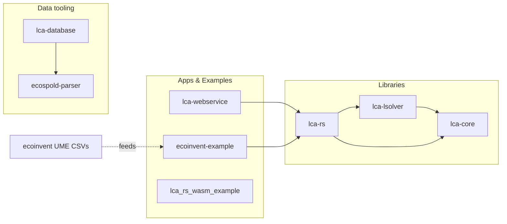

# lca-rs workspace

GPU-accelerated Life Cycle Assessment (LCA) toolchain in Rust. This monorepo contains core GPU math, linear solvers, domain glue, a web API, data tooling, and runnable examples (native and WASM).

## Projects at a glance

Libraries
- lca-core — Core primitives and GPU compute (wgpu): vectors, sparse matrices, device backends, and LCA domain models.
- lca-lsolver — GPU-accelerated iterative solvers (BiCGSTAB, CG) on top of lca-core.
- lca-rs — Glue crate exposing higher-level LCA helpers on top of lca-core and lca-lsolver; supports native and WASM.

Apps & examples
- lca-webservice — Axum-based API to compile/evaluate LCA models with streaming progress and OpenAPI docs.
- ecoinvent-example — Small example that loads ecoinvent “universal matrix export” CSVs, mixes with a custom system, and evaluates on GPU.
- lca_rs_wasm_example — Minimal browser example that loads the WASM build and runs a calculation.

Data tooling
- ecospold-parser — EcoSpold2 XML parser utilities for import pipelines.
- lca-database — Import and model storage utilities built around SurrealDB, using ecospold-parser.

## How things relate



Notes
- lca-core re-exports common types for convenience (GpuDevice, SparseMatrix, LcaSystem, etc.).
- All GPU compute goes through wgpu (native, WebGPU in browsers). WASM bindings are gated by features.

## Quick start

Prerequisites
- Rust toolchain (stable). GPU-capable machine recommended for native GPU runs.
- Optional for browser/WASM: Node.js + wasm-pack.
- Optional for ecoinvent example: universal matrix export CSVs (A_public.csv, B_public.csv, C.csv, ee_index.csv, ie_index.csv, LCIA_index.csv).

Build all crates

```bash
cargo build
```

Run the web API

```bash
cargo run -p lca-webservice
# Swagger UI: http://localhost:3000/swagger-ui
# Health:     http://localhost:3000/
```

Run the ecoinvent example

```bash
# Place CSVs under ecoinvent-example/universal_matrix_export/
RUST_LOG=info,wgpu=warn cargo run -p ecoinvent-example
```

WASM (example app)

```bash
# See lca_rs_wasm_example/ for a minimal browser setup using the generated wasm pkg.
```

## Repository layout

- ecoinvent/ — Local datasets and notebooks (e.g., universal matrix export 3.11 cut-off).
- ecoinvent-example/ — Example binary using ecoinvent UME CSVs with GPU evaluation.
- ecospold-parser/ — EcoSpold2 parser library.
- lca-core/ — Core GPU compute, math, devices, and LCA models.
- lca-database/ — Import/storage helpers (SurrealDB) using ecospold-parser.
- lca-lsolver/ — GPU iterative solvers built on lca-core.
- lca-rs/ — Glue and high-level helpers on top of lca-core and lca-lsolver (native + WASM).
- lca-webservice/ — Axum-based REST/SSE service orchestrating model build and evaluation.
- lca_rs_wasm_example/ — Minimal browser example wiring the WASM build.

## Features and targets

- Native (default): full GPU via wgpu; logging via env_logger/tracing.
- WASM: optional features enable wasm-bindgen exports; WebGPU backend enabled in lca-core when targeting wasm32.

## Data: ecoinvent UME

- The example expects the “universal matrix export” CSVs located at `ecoinvent-example/universal_matrix_export/`.
- A separate `ecoinvent/` folder holds larger datasets and analysis artifacts not used directly by the code.

---

For per-crate details, see each project’s README.

## Workspace dependency management

This repository uses Cargo's workspace inheritance to eliminate duplication:

- `[workspace.package]` centralizes `version`, `edition`, `rust-version`, `license`, `repository`, and `authors`.
- `[workspace.dependencies]` pins shared versions for commonly used libraries (GPU stack, async, error handling, serialization, tracing, benchmarks, WASM tooling).

When adding a dependency that will be shared across crates:
1. Add it (with features) under `[workspace.dependencies]` in the root `Cargo.toml`.
2. In each crate's `Cargo.toml`, reference it with `dep_name.workspace = true` (and add crate-specific `features = ["..."]` if needed).
3. Keep crate-local dependencies only if: different versions are intentionally required, features diverge significantly, or the dependency is used in just one crate.

Current centralized dependencies (abbrev):
`wgpu`, `futures`, `tokio`, `tracing`, `tracing-subscriber`, `tracing-log`, `serde`, `serde_json`, `derive_more`, `thiserror`, `log`, `uuid`, `chrono`, `criterion`, `reqwest`, `tokio-stream`, `bytemuck`, `cfg-if`, `num-traits`, `pollster`, `wasm-bindgen`, `wasm-bindgen-futures`, `js-sys`, `web-sys`, `console_error_panic_hook`, `wasm-logger`, `fastrand`, `env_logger`, `validator`, `axum-streams`.

Rationale:
- Single source of truth simplifies version bumps (e.g., tracing upgrade, serde security patch).
- Uniform feature sets (e.g., `tracing-subscriber` env-filter/json/fmt) reduce inconsistent logging output.
- WASM crates rely on shared versions to avoid duplicate JS glue.

Benchmarks & performance:
- `criterion` unified at 0.7 across solvers; adjust root version if new API changes required.

Future improvements:
- Consider `cargo-deny` or `cargo audit` CI steps.
- Evaluate moving rarely used heavy deps (e.g., `reqwest`) behind features if not needed by all consumers.

To change a shared version: update root, run `cargo check --workspace`, then run tests / benchmarks.

