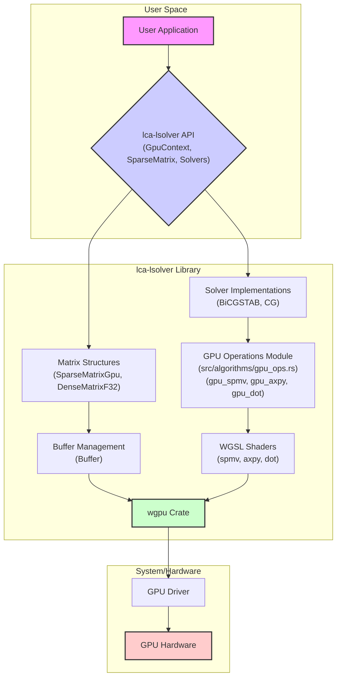

# lca-lsolver

[](https://crates.io/crates/lca-lsolver) <!-- Placeholder -->
[](https://docs.rs/lca-lsolver) <!-- Placeholder -->
[](https://opensource.org/licenses/MIT) <!-- Assuming MIT -->

A Rust library for solving systems of linear equations (Ax=b) using GPU acceleration via the `wgpu` crate. It primarily focuses on sparse matrices.

## Features

*   **GPU Acceleration:** Leverages `wgpu` for cross-platform GPU computation (Vulkan, Metal, DirectX 12, OpenGL ES, WebGPU).
*   **Sparse Matrix Support:** Efficiently handles sparse matrices, using the Compressed Sparse Row (CSR) format internally for GPU operations.
*   **Iterative Solvers:** Implements common iterative methods for solving linear systems:
    *   BiConjugate Gradient Stabilized (BiCGSTAB)
    *   Conjugate Gradient (CG) - Includes a variant (`solve_cg_checked`) that performs checks for matrix symmetry and positive diagonal elements.
*   **Basic Dense Matrix Support:** Includes structures for dense matrices, although the current solvers are optimized for sparse systems.

## Architecture

The library interacts with the GPU via the `wgpu` crate. Here's a high-level overview:



## Installation

Add `lca-lsolver` to your `Cargo.toml`:

```toml
[dependencies]
lca-lsolver = "0.1.0" # Replace with the desired version
# Required dependencies for async runtime and logging (choose your preferred ones)
tokio = { version = "1", features = ["macros", "rt-multi-thread"] }
env_logger = "0.11"
log = "0.4"
```

## Quick Start

Here's a basic example demonstrating how to solve a system Ax=b using BiCGSTAB:

```rust
use lca_lsolver::{
    algorithms::BiCGSTAB, GpuContext, GpuDevice, SolveAlgorithm, SparseMatrix,
};
use std::sync::Arc;

// Assume `create_sparse_matrix()` returns a SparseMatrix<f32>
// Assume `create_rhs_vector()` returns a Vec<f32>

#[tokio::main]
async fn main() -> Result<(), Box<dyn std::error::Error>> {
    // 1. Initialize GPU Context and Device
    let context = Arc::new(GpuContext::new().await?);
    let gpu_device = GpuDevice::new(context.clone());

    // 2. Define the problem (Matrix A and vector b)
    let n = 100; // Example size
    let a: SparseMatrix<f32> = create_sparse_matrix(n); // Your matrix creation logic
    let b: Vec<f32> = create_rhs_vector(n);      // Your RHS vector creation logic

    // 3. Setup the Solver Algorithm
    let tolerance = 1e-6;
    let max_iterations = n * 2;
    let algorithm = BiCGSTAB::with_params(tolerance, max_iterations);

    // 4. Solve the system Ax = b
    println!("Solving Ax=b...");
    let solve_result = algorithm.solve(&gpu_device, &a, &b).await;

    // 5. Handle the result
    match solve_result {
        Ok(result) => {
            println!("Solver finished successfully!");
            println!("  Iterations: {}", result.metadata.iterations);
            println!("  Final Residual Norm: {:.6e}", result.metadata.residual_norm);
            // Access the solution vector: result.x
            // println!("Solution (first 5 elements): {:?}", &result.x[..5.min(n)]);
        }
        Err(e) => {
            eprintln!("Solver failed: {:?}", e);
        }
    }

    Ok(())
}

// Helper function placeholders (replace with your actual implementation)
fn create_sparse_matrix(n: usize) -> SparseMatrix<f32> {
    // Example: Create a simple diagonal matrix
    let mut triplets = Vec::new();
    for i in 0..n {
        triplets.push((i, i, 2.0)); // row, col, value
        if i > 0 {
            triplets.push((i, i - 1, -1.0));
        }
        if i < n - 1 {
            triplets.push((i, i + 1, -1.0));
        }
    }
    SparseMatrix::from_coo(n, n, &triplets).expect("Failed to create matrix")
}

fn create_rhs_vector(n: usize) -> Vec<f32> {
    vec![1.0; n] // Example: Vector of ones
}

```

## Running Examples

Examples are located in the `examples/` directory. You can run them using `cargo run --example <example_name>`.

For instance, to run the pentadiagonal solver example:

```bash
cargo run --example pentadiagonal_solve
```

The examples use `env_logger`. You can control the log level using the `RUST_LOG` environment variable:

```bash
# Run with info level for the library and warnings for wgpu
RUST_LOG=lca-lsolver=info,wgpu=warn cargo run --example pentadiagonal_solve

# Run with debug level for the library
RUST_LOG=lca-lsolver=debug cargo run --example pentadiagonal_solve
```

## Available Algorithms

*   **`BiCGSTAB`**: BiConjugate Gradient Stabilized method. Generally suitable for non-symmetric systems.
*   **`ConjugateGradient`**: Conjugate Gradient method. Requires the matrix A to be symmetric and positive-definite. Use `solve_cg_checked` for runtime checks.

## Contributing

Contributions are welcome! Please feel free to submit issues or pull requests.

## License

This project is licensed under the MIT License - see the [LICENSE.md](LICENSE.md) file for details (assuming MIT license).
