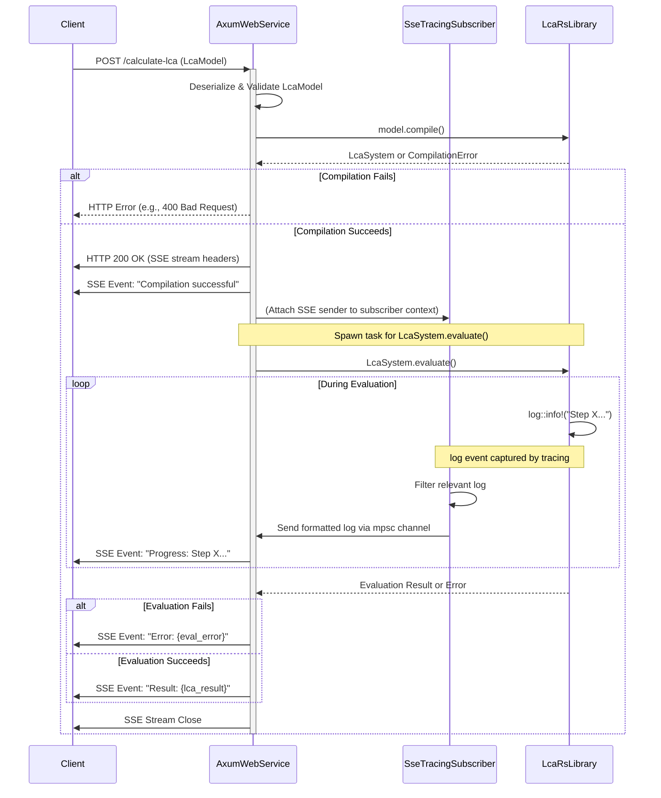

## Diagram of SSE Flow:

```mermaid
sequenceDiagram
    participant Client
    participant AxumWebService
    participant SseTracingSubscriber
    participant LcaRsLibrary

    Client->>+AxumWebService: POST /calculate-lca (LcaModel)
    AxumWebService->>AxumWebService: Deserialize & Validate LcaModel
    AxumWebService->>LcaRsLibrary: model.compile()
    LcaRsLibrary-->>AxumWebService: LcaSystem or CompilationError
    alt Compilation Fails
        AxumWebService-->>Client: HTTP Error (e.g., 400 Bad Request)
    else Compilation Succeeds
        AxumWebService->>Client: HTTP 200 OK (SSE stream headers)
        AxumWebService->>Client: SSE Event: "Compilation successful"
        AxumWebService->>SseTracingSubscriber: (Attach SSE sender to subscriber context)
        Note over AxumWebService, LcaRsLibrary: Spawn task for LcaSystem.evaluate()
        AxumWebService->>LcaRsLibrary: LcaSystem.evaluate()
        loop During Evaluation
            LcaRsLibrary->>LcaRsLibrary: log::info!("Step X...")
            Note over SseTracingSubscriber, LcaRsLibrary: log event captured by tracing
            SseTracingSubscriber->>SseTracingSubscriber: Filter relevant log
            SseTracingSubscriber->>AxumWebService: Send formatted log via mpsc channel
            AxumWebService->>Client: SSE Event: "Progress: Step X..."
        end
        LcaRsLibrary-->>AxumWebService: Evaluation Result or Error
        alt Evaluation Fails
             AxumWebService->>Client: SSE Event: "Error: {eval_error}"
        else Evaluation Succeeds
             AxumWebService->>Client: SSE Event: "Result: {lca_result}"
        end
        AxumWebService->>Client: SSE Stream Close
    end
    deactivate AxumWebService
```