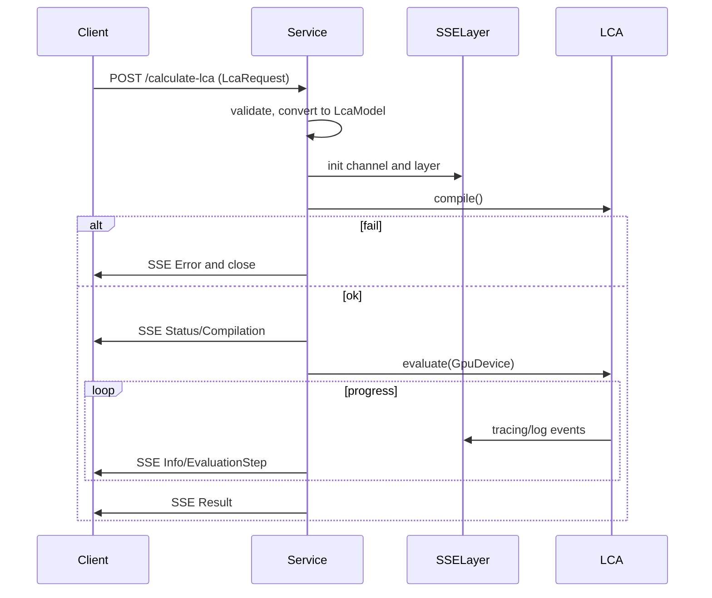

## LCA Webservice

Axum-based API that compiles and evaluates LCA models from lca-rs, streams progress via SSE, and serves OpenAPI docs.

Status: WIP but runnable. Endpoints: health check, POST /calculate-lca (SSE), /swagger-ui (OpenAPI UI).

## Run

```bash
cargo run -p lca-webservice
```

Then open:
- Swagger UI: http://localhost:3000/swagger-ui
- Health: http://localhost:3000/

Quick test (curl):

```bash
curl -N -s -H 'Content-Type: application/json' \
    -X POST http://localhost:3000/calculate-lca \
    --data-binary @example-request.json
```

## Endpoints

- GET `/` — health_check.
- POST `/calculate-lca` — JSON body matches `src/model.rs::LcaRequest`. Returns text/event-stream. Server sends ProgressUpdate events: Status, Compilation, EvaluationStep, Result, Error.
- GET `/sse` — demo endpoint emitting 3 events.

## OpenAPI

Schema and paths are defined in `src/openapi.rs` and merged in `main.rs`:
- Path handlers: `handler::calculate_lca_handler`, `health_check`.
- Schemas: `LcaRequest` and all nested request types; `ProgressUpdate`, `ErrorResponse`.

## SSE and tracing

- `SseTracingLayer` captures tracing/log events from lca-webservice, lca_rs, lca_core and forwards selected ones to the client over SSE.
- Use `send_sse_status(tx, kind, msg)` to emit simple status events.

## Flow (high level)



## Notes

- GPU device is created per request inside the worker task.
- Adjust tracing via `RUST_LOG`, e.g. `RUST_LOG=info,lca_webservice=debug,lca_rs=debug`.
 - Solver selection via env (feature-gated): set `LCA_SOLVER=pardiso` to use CPU direct solver with Intel MKL PARDISO, and optionally `LCA_SOLVER_THREADS=<n>`. Requires building with `-p lca-webservice --features lca-rs/pardiso` and MKL present at runtime.